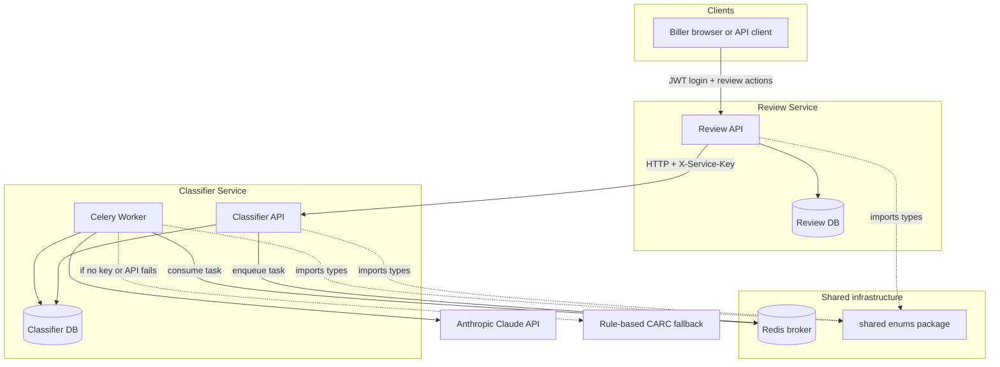
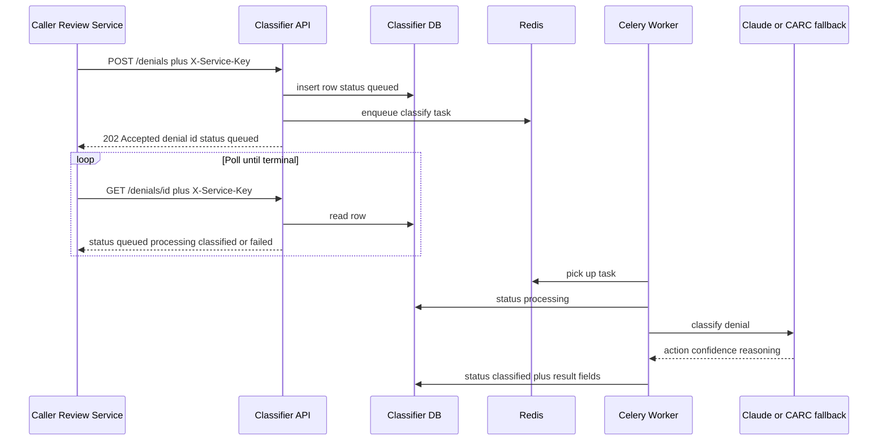
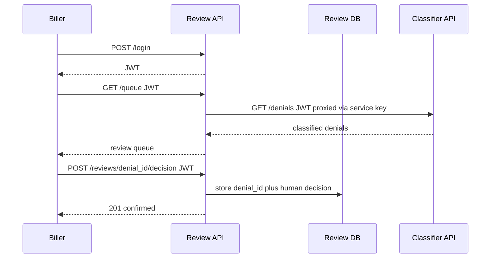
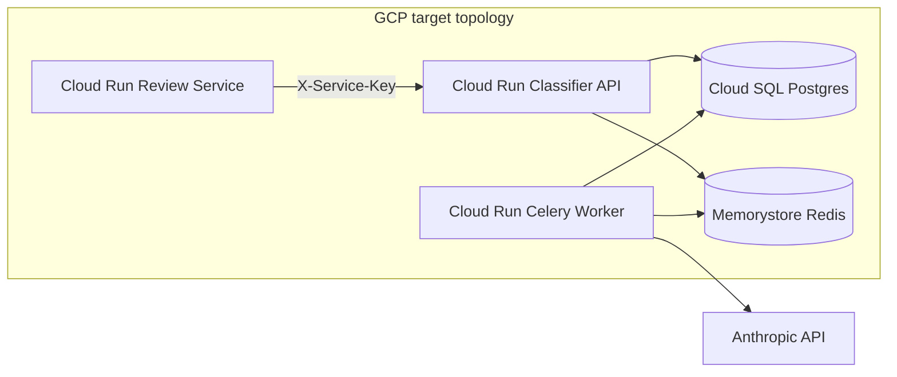
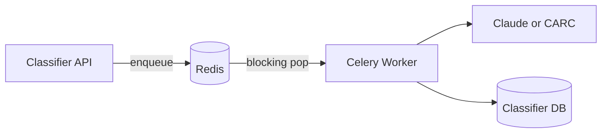

# Architecture

System design for **claim-triage-service** — medical billing denial
classification with human review. For decision rationale, see
[DECISIONS.md](DECISIONS.md).

---

## Services at a glance

| Service | Role | Auth | Owns |
|---------|------|------|------|
| **Classifier Service** | AI/rule-based denial classification | `X-Service-Key` (service-to-service only) | Full denial payload, classification result, confidence, reasoning |
| **Review Service** | Human biller approve/override | JWT (demo user login) | Opaque `denial_id`, human decision, audit metadata only |
| **shared/** | Shared types (not a runtime service) | — | `DenialStatus`, `RecommendedAction` enums |

Classifier and Review have **separate databases**. They communicate **only
over HTTP**. Review never stores payer, CPT, or dollar-amount fields from
the denial — only a reference ID and the biller's choice.

---

## System diagram



**Legend:** solid lines = runtime traffic; dashed = compile-time dependency
(shared package, fallback path).

---

## Classification flow (async + polling)

Review (or any authorized caller) submits a denial to Classifier. The API
returns immediately; the worker does the slow work.



**Recommended actions** returned by Classifier: `appeal`, `resubmit_corrected`,
`write_off`, `bill_patient`, `request_info` — always with confidence score
and reasoning, never a bare label.

---

## Review flow



Review stores **what the human decided**, not a copy of the full denial
record. Classifier remains the system of record for classification data.

---

## Local vs target cloud layout

**Today (demo):** `docker-compose` runs Classifier API, Celery worker,
Review API, Redis, and SQLite or Postgres locally.

**Target (Terraform module — modeled, not live-deployed for portfolio):**



| Component | Local demo | Target production |
|-----------|------------|-------------------|
| Classifier API | Docker / uvicorn | Cloud Run service |
| Celery worker | Docker / celery worker | Cloud Run service (separate revision) |
| Review API | Docker / uvicorn | Cloud Run service |
| Task queue | Redis container | Memorystore (Redis) |
| Database | SQLite or Postgres container | Cloud SQL (Postgres) |
| Secrets | `.env` file | Secret Manager |
| CI | GitHub Actions (planned) | GitHub Actions → deploy |

---

## Task queue: Celery/Redis vs Cloud Tasks (demo vs GCP-native fork)

This belongs in ARCHITECTURE.md (not DECISIONS.md) — same product, different
hosting choices for the async classification pipeline.

### What we build (demo + Candid-pattern match)

Candid Health's JD describes **Celery + Redis** for task queues. Our demo
and Terraform "honest model" follow that shape:

- Classifier API enqueues a task after `POST /denials` returns 202.
- **Redis** is the broker; Celery worker **blocking-pops** work (worker
  consumes the queue — not the same as Review's HTTP polling).
- Worker calls Claude, writes `classified` or `failed` back to Classifier DB.
- Review Service stays stateless; the **browser** polls Review, and each
  poll triggers a fresh `GET` to Classifier.



### Documented production fork: GCP Cloud Tasks

If this were deployed GCP-natively without self-managed Celery/Redis:

| Concern | Celery + Redis (built) | Cloud Tasks (fork) |
|---------|------------------------|---------------------|
| Delivery | Worker pulls from Redis | **Push** HTTP to worker endpoint |
| Auth between services | `X-Service-Key` shared secret | **OIDC** token on task delivery |
| Retries / backoff | Celery task config + broker | Queue config (rate limits, retry policy) |
| Ops burden | Run Redis + worker fleet (Memorystore + Cloud Run) | Managed queue; no Redis to operate |

Cloud Tasks does not change the **async shape** (accept job fast, classify
later, poll for status) — only **who runs the queue** and **how the worker
is invoked**. The Review → Classifier polling contract stays the same.

---

## Repository layout (planned)

```
claim-triage-service/
├── CLAUDE.md             # session memory — how to work, repo state, build order
├── DECISIONS.md          # why we built it this way
├── ARCHITECTURE.md       # this file — what the system looks like
├── docker-compose.yml    # local full stack
├── shared/               # DenialStatus, RecommendedAction enums
├── classifier-service/   # API, worker, models, classifier logic
└── review-service/       # JWT auth, review queue, human decisions
```
